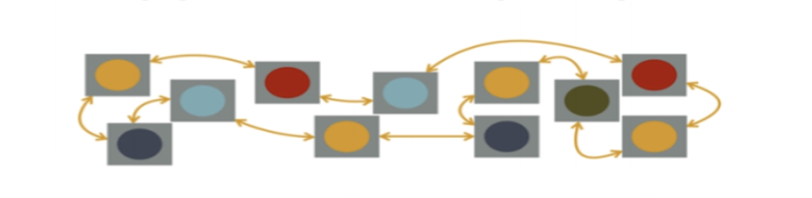
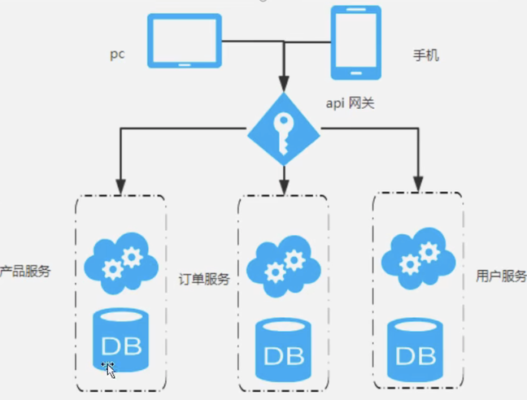

# 1、什么是微服务？

 &nbsp;&nbsp;微服务一词源于Martin Fowler（马丁.福勒）的名为 Microservices 的博文， 可以在他的官方博客上找到这篇文章：
 &nbsp;&nbsp;[http://martinfowler.com/articles/microservices.html](http://martinfowler.com/articles/microservices.html) 
 &nbsp;&nbsp;中文翻译版本：
 &nbsp;&nbsp;[https://www.martinfowler.cn/articles/microservices.html](https://www.martinfowler.cn/articles/microservices.html)

 &nbsp;&nbsp;微服务架构是一种架构模式，它提倡将单一应用程序划分为一组小的服务，服务之间相互协调、相互配合，为用户提供最终价值。每个服务运行在其独立的进程中，服务与服务支架采用轻量级的通信机制互相协作（通常是基于HTTP协议的RESTful API）。每个服务都围绕着具体业务进行构建，并且能够被独立的部署刀生产环境、类生产环境等。另外，应当尽量避免统一的、集中式的服务管理机制，对具体的一个服务而言，应根据业务员上下文，选择合适的语言、工具对其进行构建。

 &nbsp;&nbsp;简单来说，微服务是系统架构上的一种设计风格，它的主旨是将一个原本独立的系统拆分为多个小型的服务，每个服务运行在其独立的进程中，服务之间通过基于HTTP的RESTFUL API进行通信协作；
 &nbsp;&nbsp;被拆分后的每一个小型服务都专注于完成系统中的某一项业务功能，职责单一，并且每个服务服务都是一个独立的项目，可以进行独立的测试、开发、部署等；
 &nbsp;&nbsp;由于各个独立的服务之间使用的是基于HTTP的JSON作为数据通信协作的基础，所以这些微服务可以用不同的语言来开发；

# 2、为什么选择Spring Cloud构建微服务？
 &nbsp;&nbsp;近几年微服务架构讨论愈来愈烈，无数架构师和开发者在实际项目中实践着微服务架构的设计理念，他们在微服务架构中针对不同的应用场景出现的不同问题，退出了很多解决方案和框架，其中我们国内的互联网企业也有一些著名的框架和解决方案；整个微服务架构是由大量的技术架构和方案构成，比如

| 服务基础开发 | Spring、SpringMvc、SpringBoot |
| --- | --- |
| 服务注册与发现 | Netflix的Eureka、Apache的Zookeeper、阿里巴巴的Nacos等 |
| 服务调用 | RPC调用有阿里巴巴的Dubbo，Rest方式调用有当当网在Dubbo基础上扩展的DubboX、还有其他的方式实现的Rest，比如Ribbon，Feign的等 |
| 分布式配置管理 | 百度的Disconf、360的QConf、淘宝的Diamond、Netflix的Archaius等 |
| 负责均衡 | Ribbon |
| 服务熔断 | Hystrix |
| API网关 | Zuul |
| 批量任务 | 当当网的Elastic-Job、LinkedIn的Azkaban |
| 服务跟踪 | 京东的Hydra、Twitter的Zipkin等 |

 &nbsp;&nbsp;但是在微服务架构上，几乎大部分的开源组建都只能解决某一个场景下的问题，所以这些实施微服务架构的公司也是来自不同公司或组织的诸多开源框架，并加入针对自身业务的一些改进，没有一个统一的架构方案；
 &nbsp;&nbsp;所以当我们准备实施微服务架构时，我们要整合各个公司或组织开源的软件，而且某些开源软件又有多种选择，这导致在做技术选型的初期，需要花费大量的时间进行预备调研、分析和实验。这些方案的整合如果没要得到充分的测试，那么可能在实践中会遇到各种各样的问题；
 &nbsp;&nbsp;SpringCloud的出现，可以说是微服务架构中的一缕曙光，有SpringCloud社区的巨大支持和技术保障，让我们实施微服务架构变得简单起来，它不像之前我们所列举的框架那样只是解决微服务中的某一个问题，而是解决微服务架构实施的综合性解决框架方案，它整合了诸多被广泛实践和证明有效的框架作为实施的基础组件，又在该体系基础上创建了一些非常优秀的边缘组件将它们很好的整合起来。
 &nbsp;&nbsp;加之SpringCloud有Spring强大的技术背景，极高的社区活跃度，也许会成为微服务的标准技术解决方案（现在看来是的）。

