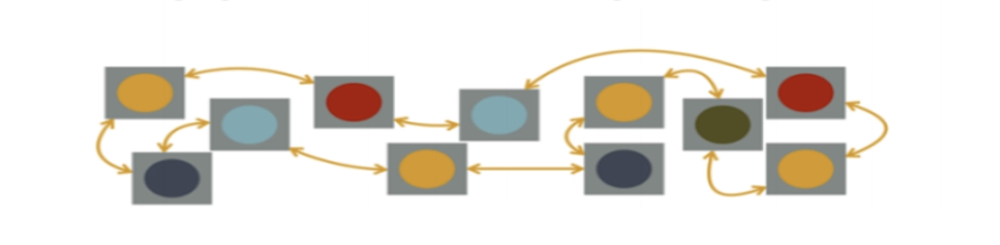
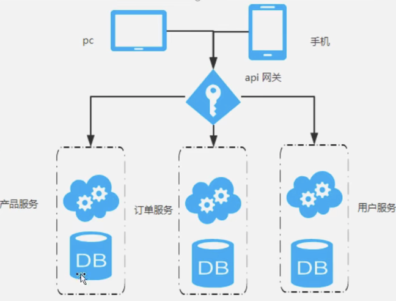

# 1、什么是微服务？

  微服务一词源于Martin Fowler（马丁.福勒）的名为 Microservices 的博文， 可以在他的官方博客上找到这篇文章：
 [http://martinfowler.com/articles/microservices.html](http://martinfowler.com/articles/microservices.html) 
 中文翻译版本：
 [https://www.martinfowler.cn/articles/microservices.html](https://www.martinfowler.cn/articles/microservices.html)

  微服务架构是一种架构模式，它提倡将单一应用程序划分为一组小的服务，服务之间相互协调、相互配合，为用户提供最终价值。每个服务运行在其独立的进程中，服务与服务支架采用轻量级的通信机制互相协作（通常是基于HTTP协议的RESTful API）。每个服务都围绕着具体业务进行构建，并且能够被独立的部署刀生产环境、类生产环境等。另外，应当尽量避免统一的、集中式的服务管理机制，对具体的一个服务而言，应根据业务员上下文，选择合适的语言、工具对其进行构建。
 
   简单来说，微服务是系统架构上的一种设计风格，它的主旨是将一个原本独立的系统拆分为多个小型的服务，每个服务运行在其独立的进程中，服务之间通过基于HTTP的RESTFUL API进行通信协作； 被拆分后的每一个小型服务都专注于完成系统中的某一项业务功能，职责单一，并且每个服务服务都是一个独立的项目，可以进行独立的测试、开发、部署等； 由于各个独立的服务之间使用的是基于HTTP的JSON作为数据通信协作的基础，所以这些微服务可以用不同的语言来开发；
 